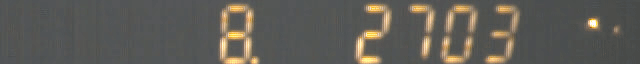

This fork additions/corrections:
* works under Linux Arduino IDE as well
* print negative numbers as well
* optional cleaning space left of printed number
* new [Digit7SegmentMillis.ino](examples/Digit7SegmentMillis/Digit7SegmentMillis.ino) example 
  * 8 digit display overflows after 27.7 hours
  * optimized loop directions for Digit7SegmentMillis example
  * special display for divisor divi>1  
    (the "8." on left, not visible during update)
* new setDecimalPoint() function (numbers keep long)

This is 1fps animation generated from Raspberry v1 camera 640x64@665fps raspiraw video.  
Demonstrates that it takes less than 3/665=4.5ms to update the 8 positions in led:  

This is 1fps animation generated from different Raspberry v1 camera 640x64@665fps raspiraw video.  
Demonstrates the changed default for Digit7SegmentMillis example, now 1/100th seconds precision with decimal point. Every 6th or 7th frame display gets updated, valid display with "8." left complete: 

DigitLedDisplay
==========
DigitLedDisplay is an [Arduino](http://arduino.cc) library for MAX7219 and MAX7221 8 bit 7-segment digital LED display module drivers.

Install
-------
[Arduino library install guide](https://www.arduino.cc/en/Guide/Libraries)

Or you can copy DigitLedDisplay library to -> arduino\libraries\

-------
*Start From Digit: Default Value Zero*\
`digitLedDisplay.printDigit(1234);`\

*Start From Digit 4*\
`digitLedDisplay.printDigit(1234, 4);`\

